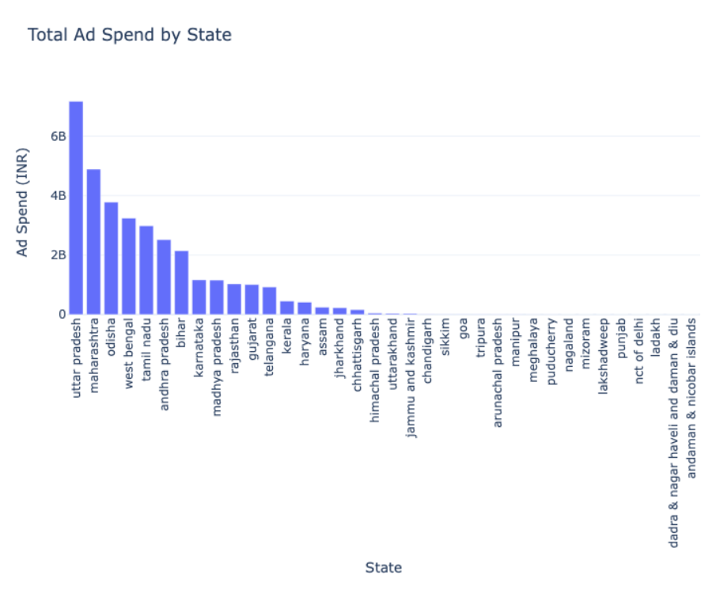
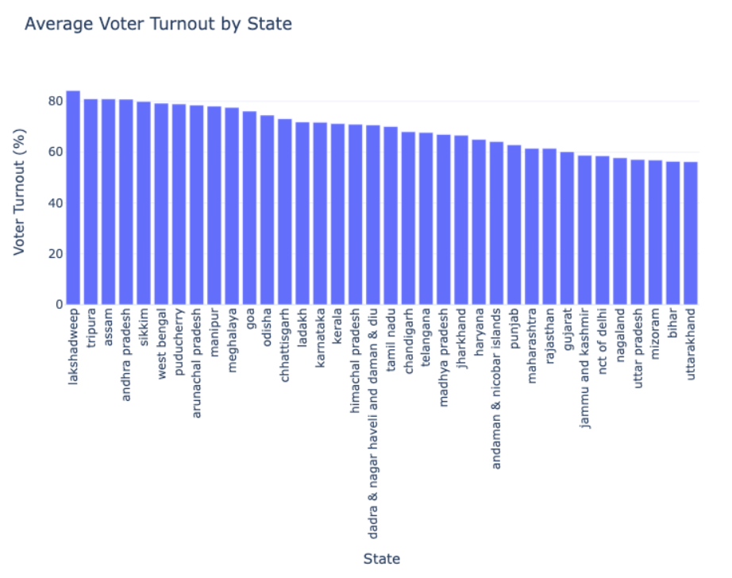
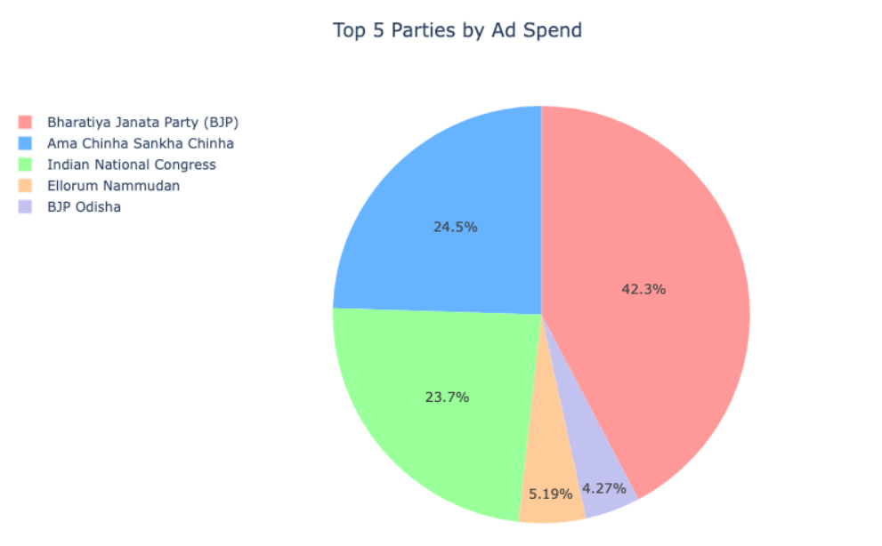
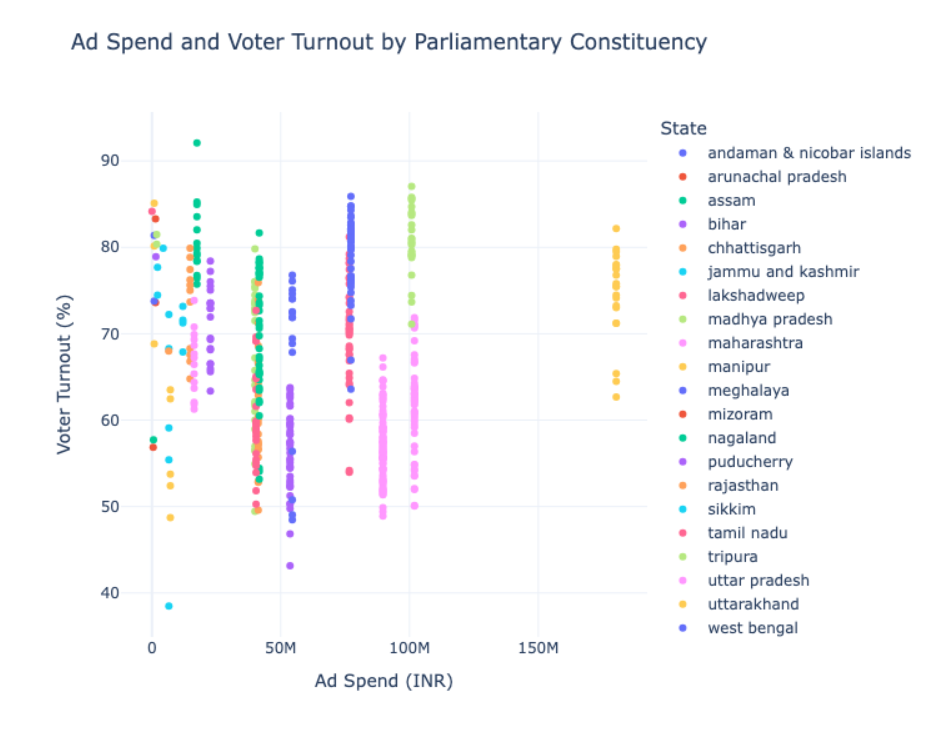
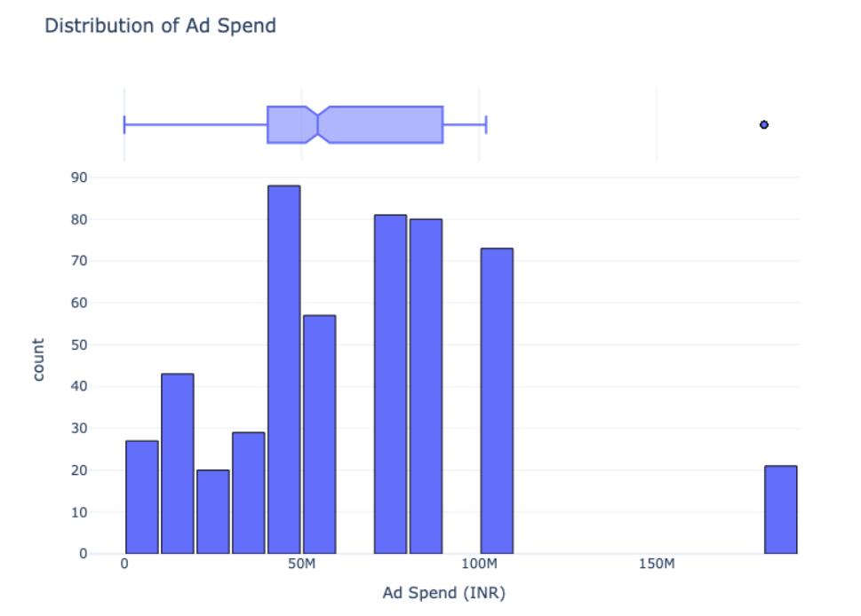
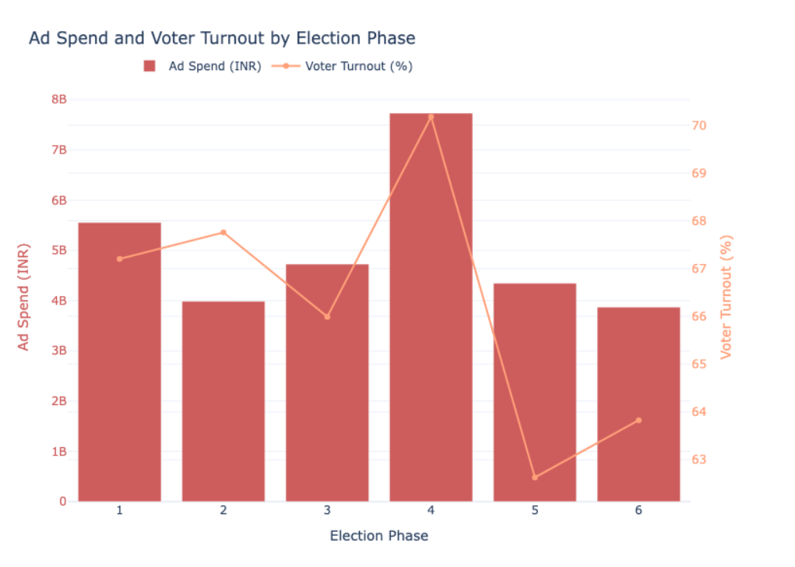

# Election-Ad-Spending-and-Voter-Turnout-Analysis# Elections Ad Spending Analysis

## Project Overview

This project presents an in-depth analysis of election ad spending and its impact on voter turnout using a dataset that includes advertiser spending, location-specific ad expenditures, and actual voting results. The goal is to understand the correlation, if any, between ad spending and voter engagement across different states and constituencies.

## Dataset Overview

The dataset consists of three key files:

- *Advertisers Dataset*: Contains data on which pages (parties or organizations) spend money on election ads and the number of ads they run.
- *Locations Dataset*: Shows the distribution of ad spending across different locations, highlighting the geographical focus of various campaigns.
- *Results Dataset*: Provides actual voting data, including the number of votes cast in each area and the percentage of voter turnout.

## Analysis Summary

### 1. *Total Ad Spend by State*

  
The analysis revealed that Uttar Pradesh leads with the highest ad spend, followed by Maharashtra and Odisha. In contrast, smaller states like Lakshadweep and union territories like Dadra & Nagar Haveli exhibit minimal ad expenditures. This suggests a correlation between ad spend and the political significance or population size of a state.

### 2. *Average Voter Turnout by State*

  
The data shows significant regional variations in voter turnout. Lakshadweep, Tripura, and Assam have the highest voter engagement, while states with high ad spending, such as Uttar Pradesh and Bihar, exhibit lower turnout. This highlights that ad spending alone does not drive voter participation.

### 3. *Top 5 Parties by Ad Spend*

  
The Bharatiya Janata Party (BJP) dominates the ad spending landscape, accounting for over 40% of the total ad expenditure. Other parties like Ama Chinha Sankha Chinha and the Indian National Congress also have substantial spends, but the BJP's investment in advertising is significantly higher.

### 4. *Correlation Between Ad Spend and Voter Turnout*

The correlation analysis reveals a weak and slightly negative relationship between ad spend and voter turnout, with a correlation coefficient of -0.010688. This suggests that higher ad spending does not necessarily result in increased voter engagement.

### 5. *Ad Spend and Voter Turnout by Parliamentary Constituency*

  
The scatter plot analysis indicates that voter turnout generally clusters between 60% and 80%, regardless of ad spend. This further supports the finding that other factors besides ad spend are at play in influencing voter behavior.

### 6. *Distribution of Ad Spending*

  
The distribution analysis shows that most constituencies have ad spends between 50M and 100M INR, with a few outliers spending significantly more. The box plot highlights that the median ad spend is around 70M INR.

### 7. *Ad Spend and Voter Turnout by Election Phase*

  
There is no consistent trend between ad spend and voter turnout across different election phases. Notably, phases with higher ad spending do not always correlate with higher voter turnout.

## Conclusion

The analyses demonstrate that higher ad spend does not guarantee higher voter turnout. While larger states tend to spend more on ads, this does not necessarily translate to greater voter engagement. Political parties, particularly the BJP, heavily invest in advertising, but the effectiveness of this spending in increasing voter turnout appears limited.
